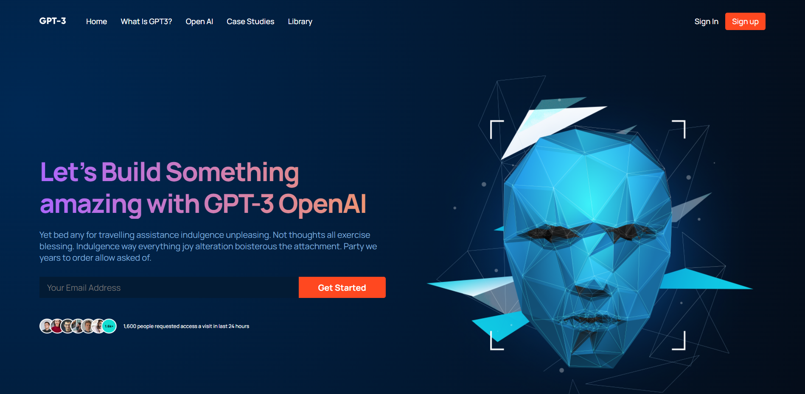
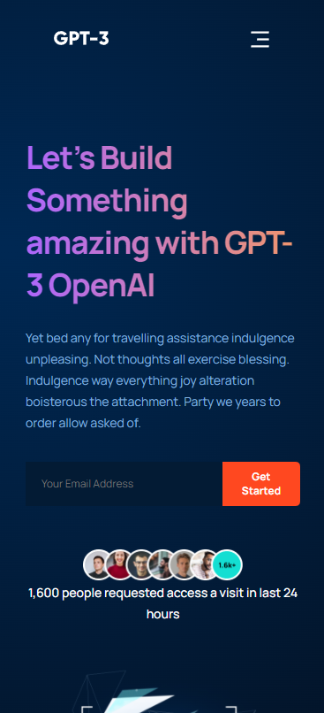

# Responsive Modern UI/UX Website

> A React application that is responsive for different media queries using CSS  
> Live Demo [_here_](https://vv-17.herokuapp.com/).

## Table of Contents

- [General Info](#general-info)
- [Technologies Used](#technologies-used)
- [Features](#features)
- [Screenshots](#screenshots)
- [Setup](#setup)
- [Usage](#usage)
- [Project Status](#project-status)
- [Room for Improvement](#room-for-improvement)
- [Acknowledgements](#acknowledgements)

## General Information

- React Application made from scratch.
- Showcase of Modern UI/UX
- Showcase of Responsive Web Design

## Technologies Used

- react - version 17.0.2
- react-icons - version 4.3.1

## Features

- Designed with Mobile in mind
- Fundamentals of the CSS BEM Model
- Able to handle the following media queries:
  - 1920x1080 Desktop
  - 768 x 1024 Tablet
  - 375 x 812 Mobile Phone

## Screenshots

### <u>Desktop View</u>

### <u>Tablet View</u>

### <u>Phone View</u>

## Setup

### Available Scripts

In the project directory, you can run:

### `yarn start`

Runs the app in the development mode.\
Open [http://localhost:3000](http://localhost:3000) to view it in the browser.

The page will reload if you make edits.\
You will also see any lint errors in the console.

### `yarn test`

Launches the test runner in the interactive watch mode.\
See the section about [running tests](https://facebook.github.io/create-react-app/docs/running-tests) for more information.

### `yarn build`

Builds the app for production to the `build` folder.\
It correctly bundles React in production mode and optimizes the build for the best performance.

The build is minified and the filenames include the hashes.\
Your app is ready to be deployed!

See the section about [deployment](https://facebook.github.io/create-react-app/docs/deployment) for more information.

## Usage

For educational and training purposes.

## Project Status

Project is: _complete_ and _no longer being worked on._\
This was a single day project to practice CSS and responsive web design

## Room for Improvement

- Add more functionality to the call-to-actions(CTAs)
- Possibly make website multi-page instead of scroll style

# Acknowledgements

- This project was inspired by Adrian Hajdin from JavaScript Mastery
- [Adrian Hajdin's Github](https://github.com/adrianhajdin)
